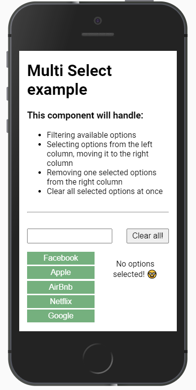
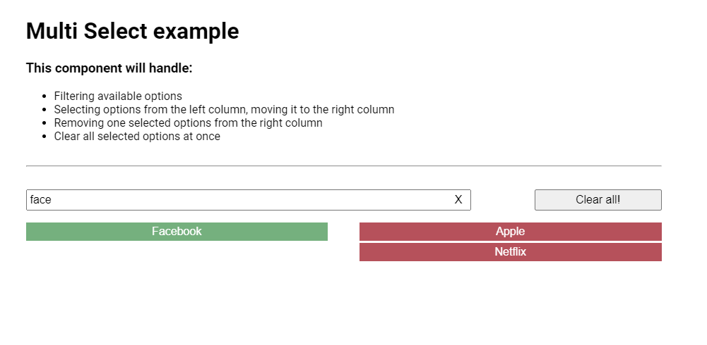
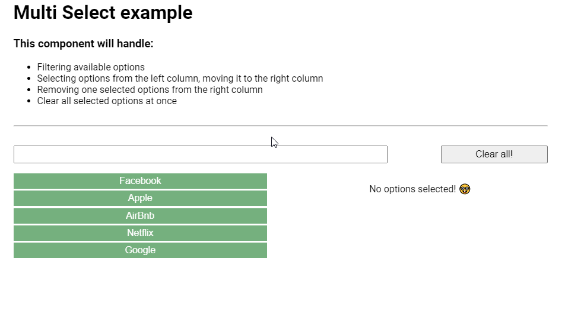

# Multi Select Component

This is a modular Multi Select component made with **`React`**, **`TypeScript`** and **`Styled Components`**.

It's responsive for any device size, fitting by default the whole width of it's container, so it's easily adaptable for any container you want to wrap this Multi Select with.

This component is a concept what will evolve with time, and after adding more customization options to it and some tests, I'll make a npm package so it's easily installable in any project.

## How to use

```
import { MultiSelect } from 'path/to/MultiSelect.tsx';

<MultiSelect options={[]} selection={[]} onChange={() => {}} clearAllEnabled />
```

## Available Props

As you can see in the interfaces and the way `App.tsx` is rendering the component, the props we can use are:

- `options` => An array of elements { id: string | number; value: string }.
- `selection` => An array of elements { id: string | number; value: string }. As the Multi Select component is controlled, this should be an external state.
- `onChange` => A function that changes the external state to control de input.
- `clearAllEnabled` => A boolean so you can choose to have the `Clear All!` button available. Defaults to `true`.

A way to control the component would be something similar to what is being rendered in `App`, like this `useState`:

```
const [selection, setSelection] = useState([]);
```

## Some preview examples

**Mobile view:**



**Desktop view:**



**GIF:**


